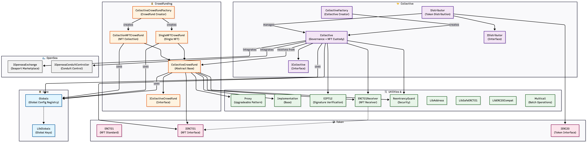

# MyMetaFi – NFT Fractionalization Protocol

## 🚀 Overview

MyMetaFi enables fractional ownership of high-value NFTs through decentralized crowdfunding smart contracts, allowing multiple users to collaboratively invest in and govern digital assets.
> ⚡ Built with production-grade smart contract architecture including proxy patterns, modular design, and secure multi-contract interactions.

## ❌ Problem

High-value NFTs are inaccessible to most users due to high capital requirements.

## ✅ Solution

Users can pool funds and collectively own NFTs, with ownership distributed proportionally on-chain.
> 🌍 Example: Multiple users can pool funds to collectively purchase a high-value NFT (e.g., a blue-chip collection), and receive proportional ownership with governance rights.

## 🔥 Key Features

* Fractional NFT ownership
* Crowdfunding with deadline logic
* Ownership distribution algorithm
* Multisig governance for fund usage
* Secure smart contract architecture

> 💡 Designed with scalability and modularity in mind, enabling multiple crowdfunding campaigns and independent governance instances.

## 🧠 Architecture

The protocol is structured into three main layers: crowdfunding contracts for fundraising, collective contracts for governance and NFT custody, and distributor contracts for ownership allocation.

## 🔄 Protocol Lifecycle

1. User creates a crowdfunding campaign via factory contract  
2. Contributors fund the campaign before deadline  
3. If funding succeeds:
   - NFT is purchased  
   - Collective contract is created  
4. Ownership shares are distributed proportionally via distributor contract  
5. Governance manages future actions (transfer, sale, etc.)  
6. If funding fails:
   - Users can withdraw their funds  

## 🧠 Design Decisions

- Used factory pattern to deploy multiple crowdfunding instances
- Separated governance (Collective) from funding logic
- Used proxy pattern for upgradeability
- Implemented modular contracts for scalability

## ⚙️ Tech Stack

* Solidity
* Hardhat / Foundry
* Ethers.js

## 📜 Smart Contracts

- CollectiveCrowdfundFactory.sol → Deploys crowdfunding contracts  
- CollectiveFactory.sol → Deploys collective governance contracts  
- CollectiveCrowdfund.sol → Handles fundraising logic  
- SingleNFTCrowdfund.sol → Crowdfunding for single NFT  
- CollectionNFTCrowdfund.sol → Crowdfunding for NFT collections  
- Collective.sol → Governance and NFT custody  
- Distributor.sol → Ownership share distribution  
- Globals.sol → Global configuration storage 

## ⚠️ Edge Cases Handled

- Contributions after deadline are rejected
- Failed funding allows user withdrawals
- Prevented double claiming of ownership
- Secured against reentrancy attacks

## 🔐 Security Considerations

* Reentrancy protection
* Access control (Ownable / Roles)
* Checks-effects-interactions pattern
> 🔒 Contracts are designed considering common DeFi vulnerabilities such as reentrancy, improper access control, and unsafe external calls.

## ❓ Why This Architecture?

- Modular design allows independent upgrades
- Factory contracts enable scalability
- Separation improves maintainability and security

## 🧪 Testing

* Unit tests using Foundry
* Covers contribution flow, deadline expiry, ownership distribution, and access control validation

## 🌍 Deployment

Contract deployment details are maintained per network in JSON files:
| Network | Deployment File |
|--------|----------------|
| Sepolia | `deploy/deployments/sepolia.json` |
| Polygon | `deploy/deployments/polygon.json` |
| Goerli | `deploy/deployments/goerli.json` |
| Ethereum Mainnet | `deploy/deployments/ethereum.json` |

## ▶️ Run Locally

1. **Clone the repository**
   ```bash
   git clone https://github.com/SiyaKesarwani/MyMetaFi.git
   cd MyMetaFi
   ```

2. **Install dependencies**
   ```bash
   npm install
   ```

3. **Install Foundry (if not already)**
   ```bash
   curl -L https://foundry.paradigm.xyz | bash
   foundryup
   ```

4. **Install required Solidity libraries**
   ```bash
   forge install dapphub/ds-test
   ```

5. **Build contracts (required for stack-too-deep cases)**
   ```bash
   forge build --via-ir
   ```

6. **Run Foundry tests**
   ```bash
   forge test --via-ir
   ```

7. **Gas usage report**
   ```bash
   forge test --gas-report --via-ir
   ```

8. **Deploy contracts (choose script as needed)**
   
   Example (deploy all core contracts):
   ```bash
   npx hardhat run deploy/deploy.js --network hardhat
   ```
   
   Or deploy individual contracts:
   ```bash
   npx hardhat run deploy/deploy_Globals.js --network hardhat
   npx hardhat run deploy/deploy_CollectiveCrowdfundFactory.js --network hardhat
   npx hardhat run deploy/deploy_SingleNFTCrowdfund.js --network hardhat
   npx hardhat run deploy/deploy_CollectionNFTCrowdfund.js --network hardhat
   npx hardhat run deploy/deploy_CollectiveFactory.js --network hardhat
   npx hardhat run deploy/deploy_Collective.js --network hardhat
   npx hardhat run deploy/deploy_Distributor.js --network hardhat
   npx hardhat run deploy/deploy_GiveawayCollectiveFactory.js --network hardhat
   npx hardhat run deploy/deploy_GiveawayCollective.js --network hardhat
   ```

   > Each script will print the deployed contract address. All addresses are also saved in the corresponding `deploy/deployments/*.json` files for each network.

> For environment variables, create a `.env` file with your Infura/Alchemy keys and private keys as needed.

## 🚀 Future Improvements

* DAO governance
* Secondary marketplace
* Cross-chain NFT support

## 💡 Key Learnings

* Designed crowdfunding logic on-chain
* Handled edge cases like deadline expiry
* Built ownership distribution system

## 📌 Note

This project is designed to demonstrate production-grade smart contract architecture and system design for decentralized asset ownership.
